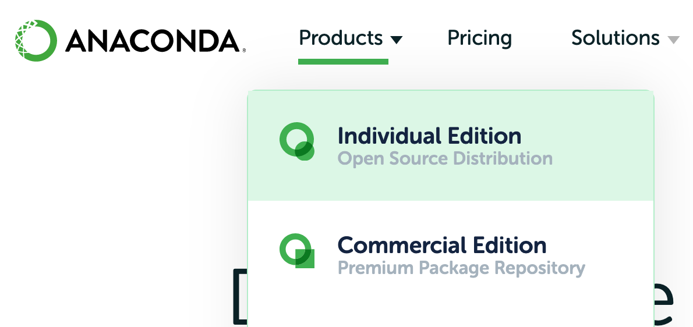

# Espapy #

A simple GUI based data viewing and analysis tool for Espadons.

### Dependencies ###

Matplotlib, PyQT, Astropy, numpy

Install Matplotlib: `conda install -c conda-forge matplotlib`

Install PyQT: `conda install -c anaconda pyqt`

Install Astropy: `conda install -c anaconda astropy`

Install Numpy: `conda install numpy`

### How to run ###

First install the dependencies, then run the `espapy.py` file contained in this directory.

Run using: `python espapy.py`

