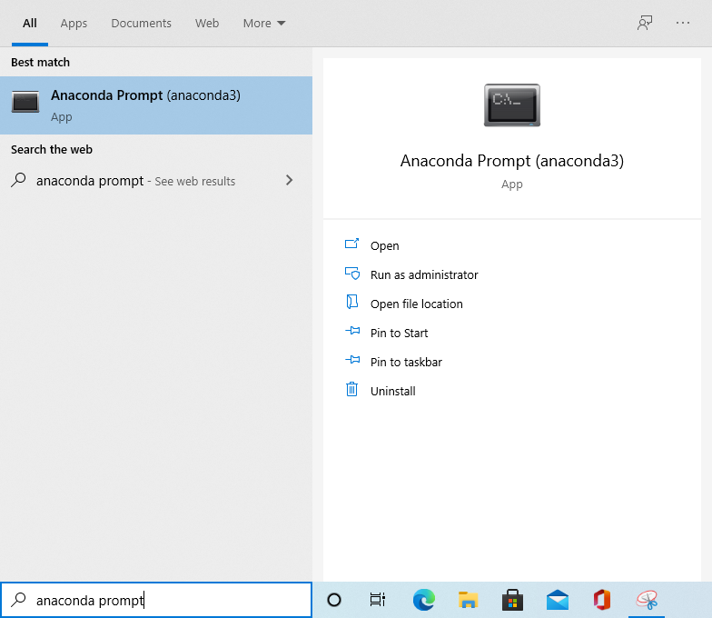
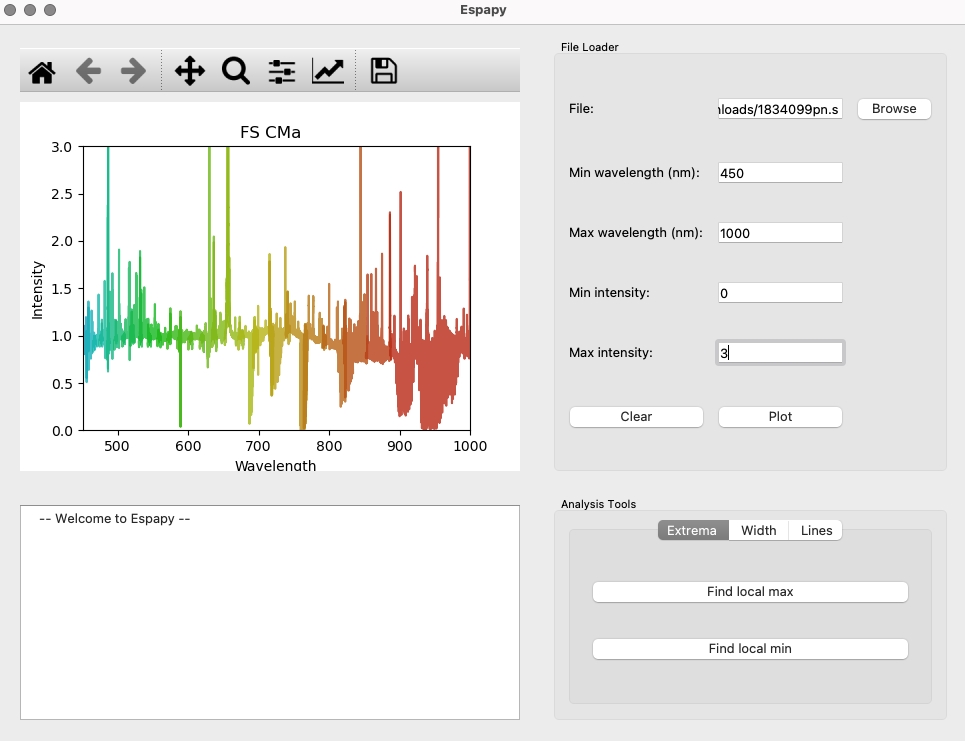

# Espapy #

A simple data viewing and analysis tool for Espadons.


## Getting Started ##

Here are instructions for getting started with Espapy. These instructions will try to explain things from the very beginning. In the end you will be able to use Espapy.

First we will download something called `Anaconda`, which is a computer program that helps us run other computer programs (in this case we will use `Anaconda` to run `Espapy`). Second, we will download `Espapy`. Third, we will run `Espapy` for the first time. Last we will plot some Espadons data and look at some extra tools.

### Step 1: Downloading Anaconda ###

To complete this step, you need at least 5 GB of space on your computer. Once you have checked that you have the required space, please go to this webpage - https://www.anaconda.com/products/individual . There should be a download button on that webpage. Click the download button to download `Anaconda`. This download will take some time.


After the download finishes, double click the file you downloaded to finish setting up `Anaconda` on your computer. Double clicking the downloaded file will open a program that walks you through the setup process. You can leave the default options as they are and just keep clicking next. It should say when it is finished. After the setup finishes, you have completed this step.


### Step 2: Downloading Espapy ###

`Espapy` is a much smaller size than `Anaconda` at under 10 MB. To download it, click the green `↓ Code` button at the top of this page. That should open up a menu where one of the options is `Download ZIP`. Click on `Download ZIP` and a compressed ZIP file that contains `Espapy` will download. It should be called `Espapy-master`. After the download completes, extract the contents of the ZIP file to an accessible place on your computer. If you are on MacOS, you can extract the contents of the ZIP file by double-clicking on it. If you are on Windows, you can right-click on the ZIP file and select the `Extract All...` option. After you extract the files, you have finished this step.


### Step 3: Running Espapy ###

The instructions for running `Espapy` on Windows and MacOS are a little different, so I will first give instructions for MacOS, then Windows. Linux users can follow the same instructions as MacOS users.

#### MacOS ####

In order to run Espapy, first open up the `Terminal` application. You can do this by using the `Spotlight Search` tool or by double clicking the `Terminal` application in your `Utilities` folder. The `Utilities` folder is located in the `Applications` folder. `Terminal` is an application that allows you to use your computer in a different way. Using `Terminal`, you can do things like move files, create folders, and run applications.  We will use it to run `Anaconda`, which in turn will run `Espapy`. 

After you open `Terminal`, the next thing to do is to navigate to the folder where you extracted `Espapy`. This is similar to navigating through folders using `Finder`. Let's see our current location by typing `pwd` into Terminal and pressing `enter`. You should see some line like `/Users/your_username` appear in the window. This is called a 'path' and represents a location within your computer.

Now that we know where we are, let's see what kinds of things we have in our current location. To do this type `ls` and press `enter`. You should see a list of files and folders appear. 

For example, say that `ls` gave us the following:

```
Applications	Downloads	Music   
Desktop		Library		Pictures 
```

Let's also say that we extracted `Espapy` to our `Downloads` folder. In order to move to our `Downloads` folder, we type `cd Downloads` and hit `enter `. You should now be in the `Downloads` folder.

Now in order to run Espapy we have to move inside of the `Espapy-master` folder we extracted. Use the `cd Espapy-master` command to do this.

Now that we are in the right place, let's run Espapy. Do this by running the `python espapy.py` command. This will run Espapy using Anaconda. You have finished this step if a new window with some buttons opens up.

#### Windows ####

In order to run Espapy, first open up the `Anaconda Prompt` application that comes with Anaconda. You can do this by using the `search` tool like so:



We will use Anaconda Prompt to run `Espapy`. 

After you open `Anaconda Prompt`, the next thing to do is to navigate to the folder where you extracted `Espapy`. This is similar to navigating through folders using `File Explorer`. Let's see our current location by looking at the most current line in our Anaconda Prompt, which should look something like:
```
(base) C:\Users\your_username>
```
The `C:\Users\your_username` is called a 'path' and represents a location within your computer. In this case it shows you your current location.

Now that we know where we are, let's see what kinds of things we have in our current location. To do this type `dir` and press `enter`. You should see a list of files and folders appear. 

For example, say that `dir` gave us the following:

```
07/12/2021  11:25 AM    <DIR>          Desktop
07/10/2021  04:55 PM    <DIR>          Documents
07/10/2021  07:29 PM    <DIR>          Downloads
04/17/2021  07:39 PM    <DIR>          Pictures
02/23/2021  10:41 PM    <DIR>          Saved Games
```

Where things like `Desktop`, `Documents`, etc are folders.

Let's also say that we extracted `Espapy` to our `Downloads` folder. In order to move to our `Downloads` folder, we type `cd Downloads` and hit `enter `. You should now be in the `Downloads` folder.

Now in order to run Espapy we have to move inside of the `Espapy-master` folder we extracted. Use the `cd Espapy-master` command to do this (you may have to do this twice).

Now that we are in the right place, let's run Espapy. Do this by typing and running the `python espapy.py` command. This will run Espapy using Anaconda. You have finished this step if a new window with some buttons opens up. 

Note: It may take up to 30 seconds to run.


### Step 4: Plotting some data ###

Here we will plot some Espadons data using Espapy.

#### Selecting a data file ####

The first step is to select some Espadons data that you want to plot. To do this, you first need Espadons data in the form of a 'data file', which you should receive from someone. Next, please press the `browse` button in the upper right of the window. A new window should pop up. Choose the data file using this window. If some text similar to `/Users/my_user_name/Desktop/1834099in.s` appears in the text box to the right of the label `File: `, you have completed this step.

#### Setting the plot limits ####

Please use the textboxes labeled `Min wavelength (nm): ` and `Max wavelength (nm): ` to set the range of wavelengths you want to plot. For example, if I am interested in something between 500nm and 600nm, I would write `500` in the `Min wavelength (nm): ` textbox and `600` in the `Max wavelength (nm): ` textbox. If you don't know what range of wavelengths you are interested in, you can type in the suggested values of `450` and `1000`.

The `Min intensity: ` and `Max intensity: ` textboxes are similar. Please use these to input the range of intensities you want to plot. For example, if I am interested in looking at intensities between 0 and 2, I would put `0` into the `Min intensity: ` textbox and `2` into the `Max intensity: ` textbox. You can also type in the suggested values if you don't know what you want.

#### Pressing the plot button ####

The next step is to press the `Plot` button. This should produce a rainbow plot of the data you selected. The portion of the data that is shown should also correspond to the wavelength and intensity ranges that you input in the previous step.



### Step 5: Moving around on the plot ###

There are also some tools that allow you to zoom-in, zoom-out, and pan on the plot. These tools are located in the tool bar in the upper left of the window, above where the data is plotted. 

### Step 6: Using the Analysis Tools ###

Espapy includes a couple other tools that may be useful for getting information out of the data. These tools are in a box labeled `Analysis Tools` in the lower right part of the window.

#### Max / min ####
The word extrema means 'maximum or minimum values'. In the tab labeled `Extrema` you will find two buttons that find the maximum and minimum values for you. The `Find local max` button will find the maximum value in the area you have plotted. It will draw a red dot at the maximum point, and it will output a message containing the wavelength and intensity of that point in the text box in the bottom left of the window. The `Find local min` button will do the same thing, except it will be finding a minimum value and drawing a blue dot.

#### Full Width at Half Max ####
Inside the tab labeled `Width`, there is a button labeled `Full width at half max`. This button will find the width of the largest peak in the plot at half of its maximum value. It will also draw a purple line where it has calculated the width to be. You need to specify the baseline value for this to work. 


## Dependencies ##

Matplotlib, PyQT, Astropy, numpy

Install Matplotlib: `conda install -c conda-forge matplotlib`

Install PyQT: `conda install -c anaconda pyqt`

Install Astropy: `conda install -c anaconda astropy`

Install Numpy: `conda install numpy`

